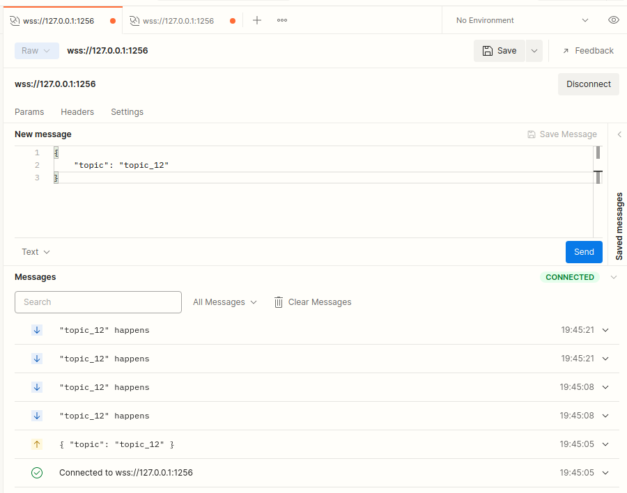
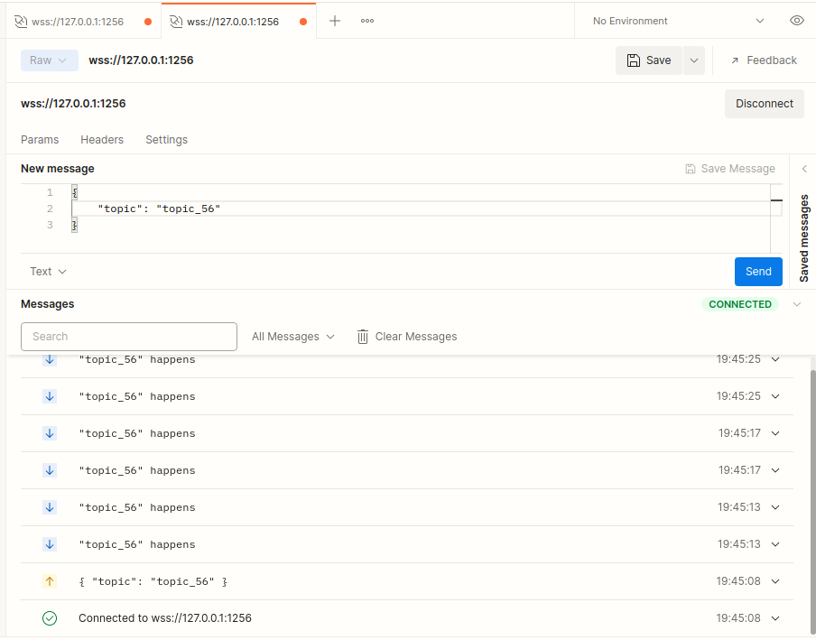

# Overview

This is a demo about how to use [uWebsockets](https://github.com/uNetworking/uWebSockets) to implement a server which supports publish and subscribe over websockets protocol (with ssl).

There are two threads, the main thread listen on  `ip:port` to wait websockets client to connect and subscribe some 
`topic` which indicated in the message it sent to server, another thread (`publishTopicRandomly`) simulate topic publish, if a topic which have been subscribed by a specific client published, the message related to this topic will be sent to the corresponding client. mutex and condition_variable are used to synchronize the two threads, thread `publishTopicRandomly` publish topic randomly after there are some clients subscribe.

# Setup

You must make [uWebsockets](https://github.com/uNetworking/uWebSockets) and its dependency(uSockets, openssl, zlib, etc) ready in your dev machine. Noted that wss (websockets with ssl) are used here so you have to compile uWebsockets with ssl option (`WITH_OPENSSL=1 make`)

# Build

This demo can build with CMake easily

`git clone https://github.com/Young-Flash/websockets-demo.git `

`cd websocket-demo`

`mkdir build && cd build`

`cmake ..`

`./websocket-demo`

# Run

You can use Postman as client to access the websockets server

|   |    |
|---------------------------------------------------|----------------------------------------------------|